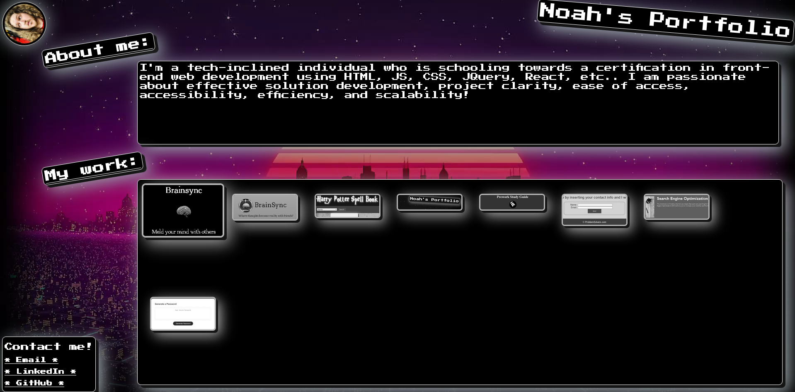

# my-react-portfolio

## Table of Contents

- [Description](#Description)
- [Installation](#Installation)
- [Usage](#Usage)
- [Demonstration]($Demonstration)
- [Deployment]($Deployment)
- [License](#License)
- [Questions?](#Questions?)

## Description

My very own website portfolio; Allowing interested parties to gaze upon my HTML, CSS, JS, React, and Node.js skill, then navigate to my completed works to properly demonstrate my front-end web development capability. Made using the criteria from Module 20 of my edX Web Development bootcamp. I made it as compact as possible within my tight time limit I had.

The application was built using HTML, JS, CSS, HTML, React, and Node.js, and was deployed using Github Pages.

## Installation

Not necessary. Access via the deployed site link.

## Usage
 
Simply follow the deployed link to the portfolio website!

## Demonstration

## Deployment

[Here.](https://NoahJRalph.github.io/my-react-portfolio)

## License

This project is protected under the MIT License.

## Questions?

Reach out to me either on [GitHub](https://github.com/NoahJRalph) or by [Email](mailto:NoahJRalph@gmail.com).
